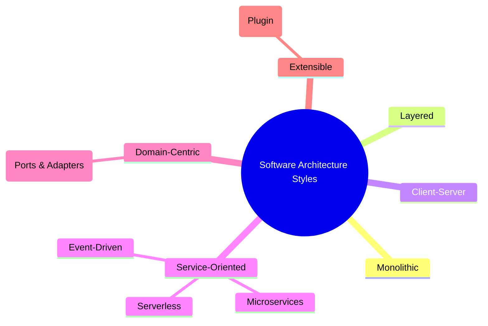

# Day 1 – Guide to Common Software Architecture Styles

**Goal for Today:** Build a mental map of the major architecture styles you’ll encounter in modern software development—what they are, when to use them, and the trade-offs involved. Keep this guide handy; we’ll dive deeper (with comparisons, decision trees, code snippets, cloud examples) in the coming days.

---

## 1. What Is Software Architecture?

Software architecture is the _high-level structure_ of a software system—the major building blocks, how they interact, and the guiding principles that shape decisions about technology, scaling, security, and change. Think of it as the blueprint for a building: if the blueprint is solid, the system can grow safely; if not, cracks show up fast.

---

## 2. Architecture vs Design vs Implementation

| Level              | Focus                                                | Time Horizon | Who Cares Most?             | Example Question                          |
| ------------------ | ---------------------------------------------------- | ------------ | --------------------------- | ----------------------------------------- |
| **Architecture**   | System structure, boundaries, communication patterns | Long-term    | Architects, Tech Leads, CTO | Should we go monolith or microservices?   |
| **Design**         | Component & class structure _inside_ a boundary      | Medium-term  | Senior Devs, Leads          | How does the OrderService validate input? |
| **Implementation** | Code, functions, loops                               | Short-term   | All developers              | How do I write this SQL query?            |

---

## 3. Quick Visual Map of Architecture Styles

Below is a high-level relationship view. We’ll unpack each style in its own section.



---

## 4. Common Architecture Styles (The Big 9)

Each section includes: **What it is**, **How it works**, **Pros**, **Cons**, **When to Use**, **Watch Out For**.

---

### 4.1 Monolithic Architecture

**What:** One deployable unit containing UI, business logic, and data access.

**How it works:** All modules compile/build into a single binary, WAR/JAR, container, or server instance. Horizontal scaling usually means replicating the whole app.

**Pros:**

- Simple to develop for small teams.
- Easy local development & debugging.
- Straightforward deployment pipeline (one artifact).

**Cons:**

- Any change requires redeploying entire app.
- Hard to scale hot spots independently.
- Tight coupling leads to “big ball of mud.”

**When to Use:** Startups, MVPs, internal tools, systems with small domain & low scaling uncertainty.

**Watch Out For:** Module boundaries dissolving; build times exploding; fear of deployments.

---

### 4.2 Layered Architecture (n-Tier)

**What:** Organize code by _responsibility layers_—Presentation, Business/Domain, Data Access, Infrastructure.

**How it works:** Calls typically flow top → bottom; lower layers rarely depend on higher layers. Often combined _with_ Monolith or Microservices (layering is _within_ a service).

**Pros:**

- Clear separation of concerns.
- Easier to swap UI or database.
- Common structure understood by most devs.

**Cons:**

- Over-layering = ceremony + latency.
- Leaky abstractions (UI reaching into DB models) if discipline slips.

**When to Use:** Enterprise apps, CRUD-heavy systems, teams with mixed experience.

**Watch Out For:** Fat “God” service layer; cross-layer shortcuts; duplicated validation logic.

---

### 4.3 Client–Server Architecture

**What:** Split into a **Client** (requests services) and a **Server** (provides services/data).

**How it works:** Client sends requests over a network (HTTP, gRPC, WebSockets); server processes & responds. Multiple client types (web, mobile, desktop) can talk to same server.

**Pros:**

- Centralized logic, data, security.
- Reusable backend across platforms.

**Cons:**

- Server is a bottleneck / single point of failure (unless scaled & load-balanced).
- Network latency matters.

**When to Use:** Nearly every web/mobile app uses some form of this.

**Watch Out For:** Chatty APIs; tight coupling of client to server schemas.

---

### 4.4 Service-Oriented Architecture (SOA)

**What:** System is organized into _services_ that represent business capabilities (Customer, Payments, Risk), usually interacting via an **Enterprise Service Bus (ESB)** or messaging backbone.

**How it works:** Services expose standardized contracts (often SOAP/XML historically; REST/JSON in modern hybrids). ESB can mediate routing, transformation, security, orchestration.

**Pros:**

- Encourages reuse across enterprise.
- Centralized governance & integration.
- Good for large organizations with legacy systems.

**Cons:**

- Heavyweight tooling/governance.
- ESB can become a choke point.
- Coarser-grained than microservices.

**When to Use:** Large enterprises integrating many heterogeneous systems (banks, telecom, insurance).

**Watch Out For:** All logic moving into ESB scripts; versioning chaos.

---

### 4.5 Microservices Architecture

**What:** System decomposed into **small, independently deployable services**, each owning its data and business capability.

**How it works:** Services communicate using lightweight protocols (REST, gRPC, events, messaging). Deploy independently; scale per-service; polyglot tech allowed.

**Pros:**

- Independent deployability & scaling.
- Technology freedom per service.
- Fault isolation: one service crash ≠ full outage (with resilience patterns).

**Cons:**

- Operational complexity (DevOps, CI/CD, observability).
- Distributed data consistency challenges.
- Network overhead & failure modes.

**When to Use:** Large-scale systems with independent teams, rapidly evolving domains, global scale workloads.

**Watch Out For:** Microservice sprawl; shared DBs (anti-pattern); unclear service boundaries; lack of end-to-end tracing.

---

### 4.6 Event-Driven Architecture (EDA)

**What:** System reacts to **events** ("OrderPlaced", "UserSignedUp"). Producers emit events; consumers subscribe/ react asynchronously.

**How it works:** Event broker (Kafka, Kinesis, RabbitMQ, NATS, Pub/Sub) routes messages. Often combined _with_ microservices.

**Pros:**

- Loose coupling.
- Reactive, near real-time flows.
- Natural audit trail through event logs.

**Cons:**

- Debugging asynchronous flows can be hard.
- Event schema evolution must be managed.
- Delivery guarantees (at-least-once, exactly-once) add complexity.

**When to Use:** Order processing, IoT telemetry, analytics pipelines, distributed workflows.

**Watch Out For:** Undocumented event contracts; consumers making synchronous calls that defeat asynchronicity.

---

### 4.7 Serverless Architecture

**What:** Use managed cloud functions + managed services; you ship code, cloud runs it on demand.

**How it works:** Events (HTTP, queue, cron, storage upload) trigger short-lived functions (AWS Lambda, Azure Functions, Google Cloud Functions). State externalized (DB, queues, object storage).

**Pros:**

- No server provisioning.
- Auto-scaling to zero.
- Pay-per-use (cost-efficient for bursty workloads).

**Cons:**

- Cold starts.
- Execution time limits.
- Vendor lock-in & local testing friction.

**When to Use:** Event-driven workloads, APIs with unpredictable traffic, automation scripts, glue code, MVP backends.

**Watch Out For:** Spaghetti of functions without architecture; hidden costs from high invocation volume or outbound calls.

---

### 4.8 Hexagonal Architecture (Ports & Adapters)

**What:** Separate _domain logic (core)_ from _infrastructure concerns_ via well-defined **ports** (interfaces) and **adapters** (implementations).

**How it works:** Core defines what it needs (e.g., `OrderRepository` port). Adapters implement using MySQL, DynamoDB, REST client, etc. Allows replacing tech with minimal domain change.

**Pros:**

- Highly testable domain (mock ports).
- Technology-agnostic core.
- Supports evolution & refactoring.

**Cons:**

- More interfaces & wiring.
- Overkill for tiny apps.

**When to Use:** Domain-driven design (DDD), systems expecting long lifespan or tech churn.

**Watch Out For:** Over-abstracting trivial dependencies; proliferation of pointless ports.

---

### 4.9 Microkernel (Plug-in) Architecture

**What:** Minimal **core system** that provides runtime + plugin contract; features delivered as **plug-ins** loaded at runtime or install time.

**How it works:** Core handles lifecycle, extension discovery, event bus; plugins contribute commands, UI elements, parsers, data processors.

**Pros:**

- Highly extensible.
- Isolates optional features.
- Community ecosystem friendly.

**Cons:**

- Version & compatibility management.
- Plugin quality varies.

**When to Use:** IDEs (Eclipse, VS Code), analytics platforms, product-based software with extensions.

**Watch Out For:** Plugin dependency cascades; performance hit from excessive extensions.

---

## 5. Side-by-Side Cheat Sheet

| Style         | Deploy Unit        | Scaling                    | Coupling                | Data Ownership       | Team Fit          | Typical Tech               |
| ------------- | ------------------ | -------------------------- | ----------------------- | -------------------- | ----------------- | -------------------------- |
| Monolith      | One artifact       | Whole app                  | Tight                   | Shared DB            | Small             | Spring Boot Jar, Rails App |
| Layered       | Internal structure | App-level                  | Disciplined             | Varies               | Mixed             | ASP.NET, Java EE           |
| Client-Server | 2-part             | Server farm                | Client depends on API   | Central              | Broad             | REST APIs, gRPC            |
| SOA           | Coarse services    | ESB-driven                 | Medium                  | Shared / legacy      | Large enterprise  | SOAP, ESB                  |
| Microservices | Many small         | Per-service                | Loose                   | Each service owns DB | Multiple squads   | Docker, Kubernetes         |
| Event-Driven  | Async consumers    | Partition, scale consumers | Loose (event contracts) | Decentralized        | Data/stream teams | Kafka, Kinesis             |
| Serverless    | Functions          | Auto cloud                 | Very loose              | Externalized         | Small/medium      | AWS Lambda, Azure Fn       |
| Hexagonal     | Pattern            | N/A                        | Core decoupled          | In core boundary     | DDD teams         | Ports/Adapters libs        |
| Microkernel   | Core + plugins     | Plugin-based               | Core stable             | Plugin local         | Product/platform  | Eclipse, VSCode            |

---

## 6. Architecture Selection Decision Flow (Quick Heuristic)

Use this lightweight flow to get a direction—you’ll refine later.

1. **Is this an MVP or small internal app?** → Start Monolith + Layered.
2. **Do you expect rapid feature growth & multiple teams?** → Modular Monolith → Microservices gradually.
3. **Do you need burst scaling or pay-per-use?** → Consider Serverless-first.
4. **Do many subsystems react to domain events?** → Add Event-Driven backbone.
5. **Is long-term domain independence important?** → Use Hexagonal within each service.
6. **Is this a product platform with extensions?** → Microkernel.

---

## 7. Combining Styles (Reality Check)

Real systems mix patterns:

- **Microservices + Event-Driven**: Services publish domain events to Kafka.
- **Monolith + Hexagonal**: Clean domain boundaries before splitting services.
- **Serverless + Event-Driven**: Lambdas triggered on S3 uploads, queue messages.
- **Microkernel UI + Microservices backend**: Extensible front-end IDE consuming distributed APIs.

Architecture is not religion—mix responsibly.

---

## 8. Architecture Quality Attributes Cheat Codes

When evaluating styles, think in terms of **-ilities**:

- **Scalability:** Can we scale parts independently?
- **Availability & Fault Tolerance:** Does one failure topple others?
- **Performance/Latency:** Too many network hops?
- **Deployability:** Can teams ship changes quickly?
- **Testability:** Can business logic be tested in isolation?
- **Maintainability:** Clear module boundaries?
- **Cost Efficiency:** Pay only for what you use?

Map your top 3 quality attributes → use them to drive architecture selection.

---

## 9. Architecture Fitness Matrix (Score Yourself)

Score 1–5 (low–high) for your candidate architecture against your top quality attributes.

| Attribute           | Weight | Monolith           | Microservices | Serverless | Event-Driven |
| ------------------- | ------ | ------------------ | ------------- | ---------- | ------------ |
| Deploy Speed        | 2      | 4                  | 3             | 5          | 4            |
| Independent Scaling | 3      | 1                  | 5             | 4          | 5            |
| Observability       | 2      | 4                  | 3\*           | 3\*        | 2\*          |
| Complexity          | 1      | 5 (low complexity) | 2             | 3          | 2            |

> \*Observability in distributed systems can be great—but only if you invest in tooling; default is harder.

Use this as a thinking tool; adjust numbers for your context.

---

## 10. Visual Architecture Summary Diagram (Printable)

Below is a compact ASCII overview you can include in slides or handouts.

```text
+-------------------------- Software Architecture Styles ---------------------------+
| Monolith      | One deployable unit; simple start; hard to scale piecewise.       |
| Layered       | Organized by tiers (UI, Biz, Data); separation of concerns.       |
| Client-Server | Frontend talks to backend over network; central data/logic.       |
| SOA           | Enterprise services + ESB mediation; good for legacy integration. |
| Microservices | Many small, independent services; scalable but operationally hard.|
| Event-Driven  | Emit/consume events async; reactive, loosely coupled workflows.   |
| Serverless    | Cloud-managed functions; auto-scale; watch cold starts & limits.  |
| Hexagonal     | Domain core decoupled via ports/adapters; tech-agnostic core.     |
| Microkernel   | Minimal core + plugins; highly extensible platforms.              |
+-----------------------------------------------------------------------------------+
```

---

## 11. Practice Exercise (Do This Today)

Pick a system you know (work project, side app, or popular product like Uber or Flipkart). For each of the 9 styles:

1. Would it fit? Why / why not?
2. What quality attributes improve? Which suffer?
3. What team/org factors help/hurt?

_Write brief bullets—5–10 min per style._ This reflection is where learning sticks.

---

## 12. Takeaways

- Architecture = strategic structure + decisions that are hard to change later.
- Start simple; evolve as complexity demands.
- Know the trade-offs; every style solves some problems and creates others.
- Hybrid architectures are normal.

---
