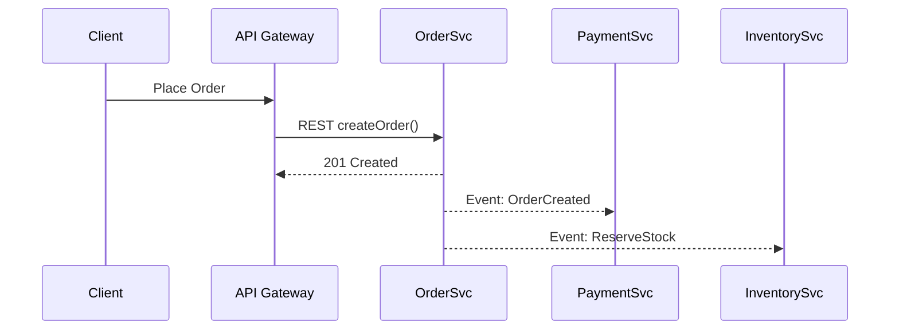

# Day 2 – Monolith to Microservices: Migration Paths & Decision Framework

**Series:** Learn Software Architecture (Day 2 of N)

**Goal for Today:** Go beyond buzzwords. Understand _why_ teams move (or don’t move) from a **Monolith** to **Microservices**, what a **Modular Monolith** is (and why it’s your best friend), how to plan an _incremental_ migration, and which **anti-patterns** to avoid.

**What You’ll Get:**

- Deep comparison: Monolith vs Modular Monolith vs Microservices.
- When to stay put, when to split, when to go hybrid.
- Step-by-step migration playbook (with technical patterns).
- Data ownership + integration strategies.
- Readiness scorecard & migration checklist.
- Practitioner Q&A.

---

## 1. Quick Recap from Day 1

From Day 1 we learned that architecture is the _strategic_ structure of a system. We also saw 9 common styles and their trade-offs. Today we zoom in on the **most debated pairing: Monolith ↔ Microservices**—and everything in between.

---

## 2. Architecture Spectrum (It’s Not Binary!)

Monolith and Microservices are not two islands—you move along a **spectrum of modularity + deployment independence**.

**Architecture Spectrum:**

```
Classic Monolith → Layered/Structured Monolith → Modular Monolith (Enforced Boundaries) → Distributed Monolith (Bad Split) → Microservices → Event-Driven / Service Mesh → Hybrid (incl. Serverless Functions)
```

**Key Idea:** Every system lives somewhere on this spectrum—consciously designed or accidentally evolved. Your job is to move _intentionally_.

---

## 3. When Is a Monolith the Right Choice?

| Signal                | Explanation                  | Why Monolith Works           |
| --------------------- | ---------------------------- | ---------------------------- |
| Small team (≤10 devs) | Communication overhead low   | One repo, fast changes       |
| Early product/MVP     | Requirements fluid           | Avoid infra tax; ship faster |
| Tight deadlines       | Need speed > perfect scaling | Simple build → deploy        |
| Low traffic           | Scaling not a pain (yet)     | Vertical scale OK            |
| Rapid iteration       | Refactor daily               | No cross-service contracts   |

**Rule of Thumb:** If you are still discovering product–market fit, a well-structured monolith is usually _faster, cheaper, safer_.

---

## 4. Where Monoliths Hurt

- **Long build & deploy cycles** – Fear of releasing.
- **Scaling hotspots** – One module melts CPU but must scale whole app.
- **Tangled dependencies** – Changes in auth break billing.
- **Slow onboarding** – New devs face massive codebase.
- **Partial outages = full outage** – One bug can crash everything.

If ≥3 of the above are chronic _and_ you have enough engineering capacity, it’s time to evaluate modularization.

---

## 5. Enter the Modular Monolith (Your Migration Staging Area)

A **Modular Monolith** is still one deployable artifact, _but internally_ it enforces strong module boundaries—sometimes with tooling that prevents cross-module imports.

**Characteristics:**

- Clear domain modules (Accounts, Orders, Catalog, Billing).
- Interfaces/contracts between modules.
- Shared database _logically_ partitioned (schemas, table namespaces, or access layers).
- Independent test suites per module.

**Why it Matters:** It’s the safest runway to microservices. You practice separation, interfaces, and data boundaries _before_ adding network + deployment complexity.

---

## 6. Deep Comparison: Monolith vs Modular Monolith vs Microservices

| Dimension              | Classic Monolith    | **Modular Monolith**              | Microservices                      |
| ---------------------- | ------------------- | --------------------------------- | ---------------------------------- |
| Deployable Units       | 1                   | 1                                 | Many                               |
| Enforced Boundaries    | Weak                | Strong (compile/build-time rules) | Network contracts                  |
| Scaling                | Whole app           | Whole app (but hotspots visible)  | Per service                        |
| Tech Stack Flexibility | Single              | Mostly single                     | Polyglot                           |
| Data Ownership         | Shared DB           | Shared DB (logical partitions)    | Service-owned DBs                  |
| Testability            | Slow, cross-cutting | Module-level + integration        | Per-service CI + contract tests    |
| Failure Isolation      | Low                 | Low–Med                           | High (if designed well)            |
| Operational Overhead   | Low                 | Low–Med                           | High (CI/CD, infra, observability) |
| Team Autonomy          | Limited             | Improved (module owners)          | High (service owners)              |
| Good For               | MVP, small teams    | Growing teams preparing to scale  | Large orgs, scale, fast releases   |

---

## 7. Decision Signals: Stay, Strengthen, or Split?

Use this quick scoring grid. Rank each 1–5 (5 = severe pain / strong driver for change).

| Factor                         | Score (1–5) | Notes |
| ------------------------------ | ----------- | ----- |
| Build/Deploy Time Pain         |             |       |
| Scaling Pain (hotspots)        |             |       |
| Domain Complexity              |             |       |
| Team Count / Parallel Work     |             |       |
| Regulatory Isolation Needs     |             |       |
| Uptime / Blast Radius Concerns |             |       |

**Heuristic:** Total ≥18? Start modularization immediately. ≥22? Plan extraction of at least one service in next 1–2 release cycles.

---

## 8. Migration Playbook: Monolith → Modular Monolith → Microservices

### Step 0 – Baseline & Align

- Identify stakeholders (engineering, product, ops, security).
- Capture pain points with metrics (lead time, MTTR, deploy frequency, build time).
- Define _why_ you’re migrating (speed? scale? reliability?).

### Step 1 – Stabilize & Strangle the Messy Parts

- Freeze new features in worst-coupled areas.
- Add integration tests around mission-critical flows.
- Introduce feature flags for safer refactoring.

### Step 2 – Carve Domain Boundaries

- Use **Domain-Driven Design (DDD)**: identify bounded contexts.
- Group code into modules/packages per domain.
- Break cyclic dependencies.

### Step 3 – Enforce Interfaces Internally

- Create internal service facades or interfaces.
- Block cross-module imports at build time (lint/build plugins).
- Start measuring module-level coupling.

### Step 4 – Isolate Data Access

- Introduce a data access layer per domain module.
- Use database schemas / logical partitions.
- Audit cross-module queries; replace with contract methods.

### Step 5 – Extract First Service (Low-Risk, High-Learning)

Good candidates:

- Authentication / Identity
- Notifications / Email / SMS
- Reporting / Analytics (read-mostly)

**Extraction Checklist:**

- Copy code to new repo.
- Wrap old module with API calls to new service.
- Migrate data (full or read-through cache).
- Run in parallel (shadow traffic) before cutover.

### Step 6 – Introduce an API Gateway / Edge Layer

- Central entry point for clients.
- Can translate from monolith routes → service routes.
- Add auth, rate limiting, observability.

### Step 7 – Expand with Strangler Fig Pattern

- Route specific endpoints from gateway to new services.
- Gradually shrink monolith surface area.
- Retire unused code.

### Step 8 – Data Decoupling Strategies

- **Database-per-Service** (ideal but slower to reach).
- **Schema Ownership** (shared DB, strict write ownership).
- **Change Data Capture (CDC)** to replicate data to new stores.
- **Event Outbox Pattern** to publish domain events reliably.

### Step 9 – Distributed Patterns (as Needed)

- **Saga / Orchestration** for multi-service workflows.
- **Event-Driven Integration** for async propagation.
- **Circuit Breakers, Retries, Timeouts** for resilience.

### Step 10 – Operate & Iterate

- Observability: tracing + logs per request ID.
- Automated rollbacks.
- Post-mortems and boundary refinements.

---

## 9. Data Ownership & Integration Models

| Model                        | Description                        | Pros           | Cons                         | Use When               |
| ---------------------------- | ---------------------------------- | -------------- | ---------------------------- | ---------------------- |
| Shared DB                    | All services hit same DB           | Simple early   | Tight coupling, schema risk  | Transitional only      |
| Shared DB w/ Ownership Rules | One service writes; others read    | Gradual split  | Hard to enforce              | Migration stage        |
| DB-per-Service               | Each service owns private store    | Loose coupling | Distributed data consistency | Target end state       |
| Event-Carried State Transfer | Services replicate via events      | Scales reads   | Event lag, replay            | Analytics, caches      |
| API Composition              | Query multiple services at runtime | No duplication | Latency chain                | low-volume aggregation |

---

## 10. Communication Patterns: Sync vs Async



**Guideline:** Use synchronous calls for _critical, immediate_ user feedback; publish events for downstream side-effects.

---

## 11. Anti-Patterns Hall of Shame

| Anti-Pattern              | Why It’s Bad                                                 | Safer Alternative                                          |
| ------------------------- | ------------------------------------------------------------ | ---------------------------------------------------------- |
| **Distributed Monolith**  | Services exist but are tightly coupled; must deploy together | Enforce backward-compatible APIs + consumer contract tests |
| **Shared Write Database** | Schema change = global outage                                | Service-owned schema; publish events                       |
| **Nanoservices**          | Too many tiny services → overhead > value                    | Right-size domain boundaries                               |
| **Big Bang Rewrite**      | Long freeze, high failure risk                               | Incremental strangler migration                            |
| **Version Chaos**         | Clients pinned to old APIs                                   | Semantic versioning + deprecation windows                  |

---

## 12. Tooling & Platform Enablers

**Build & Deploy:** GitHub Actions, GitLab CI, Jenkins, AWS CodePipeline.

**Containers & Orchestration:** Docker, Kubernetes, ECS, AKS, GKE.

**Service Mesh / Networking:** Istio, Linkerd, AWS App Mesh, Consul.

**API Gateway / Edge:** Kong, NGINX, AWS API Gateway, Apigee, Traefik.

**Messaging / Events:** Kafka, Amazon Kinesis, RabbitMQ, Google Pub/Sub, NATS.

**Observability:** OpenTelemetry, Jaeger, Prometheus, Grafana, Datadog, New Relic.

**Config & Secrets:** HashiCorp Vault, AWS Parameter Store, Azure Key Vault.

---

## 13. Migration Readiness Scorecard

Score 1–5.

| Area                        | Weight | Score | Weighted |
| --------------------------- | ------ | ----- | -------- |
| Automated Tests Coverage    | 3      |       |          |
| CI/CD Discipline            | 2      |       |          |
| Monitoring/Logging Maturity | 2      |       |          |
| Domain Boundary Clarity     | 3      |       |          |
| Team Autonomy               | 2      |       |          |
| Infra / DevOps Capacity     | 3      |       |          |

**Recommendation:**

- <20: Strengthen monolith + tooling first.
- 20–28: Begin modularization.
- > 28: Ready for targeted service extraction.

  ***

## 14. Migration Runbook Template

**Project Name:** **Driver(s):** Scale / Deploy Speed / Reliability / Compliance. **Target Services (Phase 1):** Auth, Notification, Reporting. **Milestones:**

1. Boundaries identified.
2. Build/test harness per module.
3. Data ownership rules defined.
4. First service in prod (shadow).
5. Traffic cutover.
6. Post-migration review.

---

## 15. Practitioner Q&A

**Q: How big should a microservice be?**\
Small enough that a single team can understand, test, and deploy it independently—but big enough to own a meaningful business capability.

**Q: Can I use a shared DB forever?**\
You _can_; you probably _shouldn’t_. Use it temporarily while extracting read-only views or publishing domain events.

**Q: What about performance overhead?**\
Network hops and serialization add latency. Use aggregation services or co-locate chatty services early.

**Q: When do I need a service mesh?**\
Only after you have many services and need uniform traffic policies, mTLS, retries, and observability at scale.

---

## 16. Exercises (Do These Today)

1. **Map Your Monolith:** List top 5 functional areas. Which depend on which? Draw arrows.
2. **Coupling Heatmap:** Mark which areas change together in last 20 commits.
3. **First Extraction Candidate:** Pick a low-risk domain. Why is it safe?
4. **Data Audit:** Which modules write to which tables? Who _should_ own them?
5. **Deployment Drill:** How long from commit → prod? What breaks if we split repos?

---

## 17. Takeaways

- Monoliths are _fine_—until scaling, velocity, or reliability pains demand modularity.
- A **Modular Monolith** is the safest on-ramp to microservices.
- Extract low-risk, well-bounded capabilities first.
- Data ownership is the hardest part—plan early.
- Invest in **automation + observability** _before_ breaking things apart.

---
